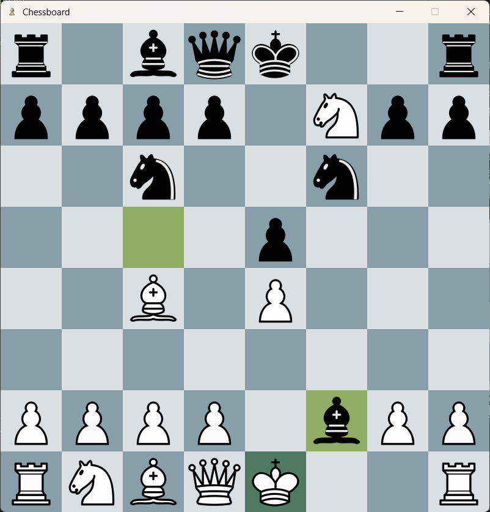
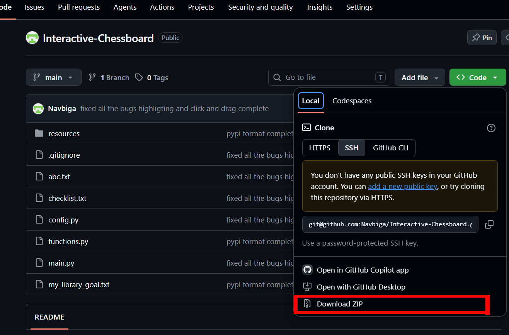
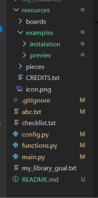
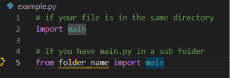

# Interactive chessboard
### Sumary:
This is a python  lib that summons a working chessboard with 
pygame as a window on your computer. 

### NOTE!!!

This **library is still in works** and some of the moves like casteling, promotion and en passan **DO NOT WORK** , but you are still more than welcome
to try it out i am actively updating it. **In the near future i will publish it to PYPI**



*if you want more images how the board looks go to* ***resources/examples/previev***

## Features

You can customize your graphical look with:

- **27 chessboard styles**
- **57 piece sets**

The chessboard is interactive, **it handles clicks with a custom chess engine** to validate if your move is legal and then moves your piece to the square. 


The library has **many commands** for the control of the board so **you can make your own projects** like:

- **Training ai** to play chess
- Analizing positions with Lichess database (open source)
- or even doing a **co-op** if you want to dig inside the lib

*For more info about the commands go to the chapter bellow instalation*

## Instalation

### Note:
In the future i will upload on PYPI and the proces will be easier


On the github page you cana find the **green Code button** when you click it you can find **Download zip**. If you use git feel free to clone it into you folder.



After you download the zip **unwrap it**, i belive you know how to do that *(if not ask ai)*. and move it to your folder / directory when you want to work with it.





After That create a new python file and import the main.py. and you will be using the library



## Library commands

lets start off with the basics and slowly make it more complex.

```python
board = Chessboard()    

while run:
    event = board.update()
    if event == 'quit':
        break
```
This is the bare minimum the first line makes an object an starts the chessboard. Next there is a while loop and the board.update() you need thid to update the window if you dont include it you will get a frozen window, but at the same time it outputs something if something happens. If it outputs 'quit' it means the window closed. also if the python file finishes the window automaticly closes. lets move on

```python
board = Chessboard()    

while run:

    event = board.update()

    if event == 'quit':
        break

    if event == 'move':

        # Keep in mind this return a dictionary not something like Nh4 or 0-0
        last_move = board.get_last_move()
        print(last_move)
```
```python
{
"from": start_square,
"to": end_square,
"piece": piecetype,
'color': color of piece,
"captured": piecetype that was captured,
"notation": f"{start_square}-{end_square}"
}
```
This program prints the info for every move you played in this format. You can make your list of moves that was played or more.
Now lets move into some config comands


